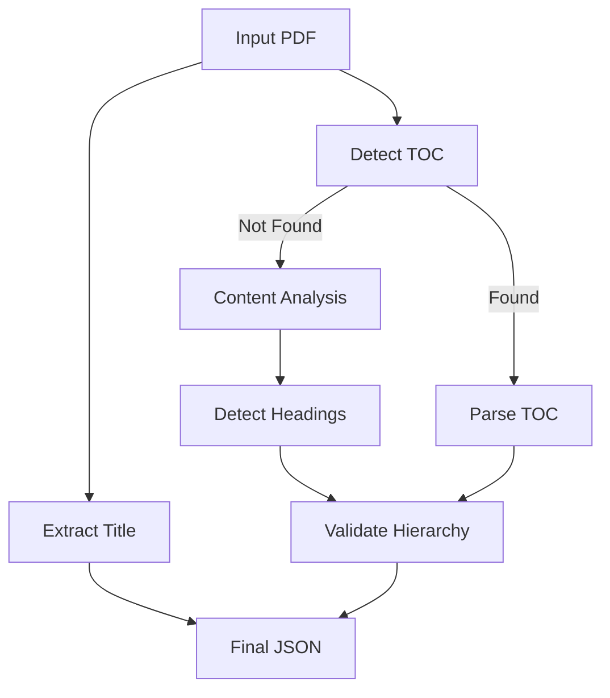

# Adobe Round 1a: Understand Your Document - Solution

---
## Execution
### Build Docker image:
`docker build --platform linux/amd64 -t startersnsides:latest .`
### Run Docker container:
`docker run --rm -v $(pwd)/input:/app/input -v $(pwd)/output:/app/output --network none startersnsides:latest`

---
## Key Components

### 1. Libraries Used

- **PyMuPDF (fitz)** – Core PDF processing library  
- **jsonschema** – JSON validation  
- **typing** – Type annotations  
- **logging** – Structured logging  

### 2. Core Class

#### `PDFOutlineExtractor`

Main class handling all extraction logic with these key methods:

- `def extract_title(self, doc)`  
  → Extracts the document's title  
- `def extract_outline(self, pdf_path)`  
  → Full document outline pipeline  
- `def detect_heading_level(self, ...)`  
  → Classifies headings as H1, H2, or H3  

---

## Extraction Strategy

### 1. Title Extraction

Analyzes the **first page content** and identifies text with:

- **Largest font size**
- Located in **top half**
- Font size > **24pt**
- **Merges overlapping text fragments**

### 2. Outline Extraction

Uses a multi-stage approach:

#### ➤ Table of Contents Detection

- Checks for **built-in PDF TOC**
- Searches for **manual TOC pages**
- Parses entries using regex patterns

#### ➤ Content Analysis Fallback

If no TOC is found:

- Calculates **average font size**
- Detects headings based on:
  - **Font size ratio**
  - **Bold/italic** formatting
  - **Position on page**
  - **Text patterns** (e.g., numbered lists)
- Validates heading **hierarchy**

### 3. Heading Classification

Determines heading levels using:

- Font size comparison
- Numbering patterns (`1.`, `1.1`, etc.)
- Text formatting (bold/italic)
- Indentation
- Relative position context

---

## Processing Pipeline

---
