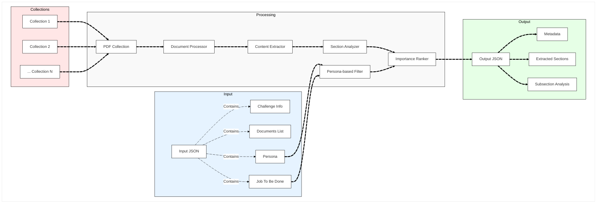

# Adobe Round 1b: Persona-Driven Document Intelligence - Solution

## Libraries Used
- **NumPy**: 1.24.3 (numerical computations)
- **scikit-learn**: 1.3.0 (cosine similarity, utilities)
- **PyTorch**: 2.0.1 CPU version (embedding model backend)
- **transformers**: 4.35.2 (sentence transformer models)
- **sentence-transformers**: 2.5.1 (embedding generation)
- **rank-bm25**: 0.2.2 (BM25 implementation)
- **PyMuPDF**: 1.23.8 (PDF processing)

## System Requirements
- **Python**: 3.10+ (type hints, modern features)
- **Memory**: 200-400MB recommended for large collections
- **Storage**: 500MB for models and temporary files
- **Network**: Initial model download (~70MB)

## Key Features and Metrics:
- Hybrid BM25 + Sentence Embeddings approach
- Domain-specific parameter tuning
- Multi-field scoring with heading emphasis
- Robust fallback mechanisms
- Modular Design by utilizing heading extractions from 1A Challenge
- No usage of Language Models
- Eliminated Internet/API calls usage
- Based on given Test Collections:
  - **Collection 1** (7 PDFs): <20 seconds
  - **Collection 2** (15 PDFs): <45 seconds  
  - **Collection 3** (9 PDFs): <40 seconds
- **Domain detection accuracy**: ~95%
- **Query expansion coverage**: ~80%
- **Result diversity**: >90% unique documents
- **Model size (Embedding Model)**: 69.6MB
  
## 📁 File Structure

```
StartersNSides-1B/
├── approach_explanation.md      # Methodology documentation
├── Dockerfile                   # Container configuration
├── .dockerignore               # Docker build optimization
├── requirements.txt            # Python dependencies
├── src/                        # Source code
│   ├── run_pipeline.py         # Main pipeline (CLI support)
│   ├── extract/                # Document processing
│   ├── retrieval/              # Hybrid retrieval engine
│   ├── output/                 # Output formatting
│   └── utils/                  # Utility functions
└── Challenge_1b/               # Test data collections
```
## Prerequisites

### For Docker (Recommended)
- Docker installed on your system
- At least 4GB RAM available for Docker
- 1GB free disk space

### For Local Development
- Python 3.10 or higher
- pip package manager
- At least 4GB RAM
- 1GB free disk space

## Execution

### Local Execution
### 1. Install Dependencies

```bash
# Navigate to the project root directory
cd /path/to/StartersNSides-1B

# Install Python dependencies
pip install -r requirements.txt
```

### 2. Run the Pipeline

```bash
# Navigate to src directory
cd src

# Run with default paths (/app/input/challenge1b_input.json and /app/output/output.json)
python run_pipeline.py

# Use custom input and output paths
python run_pipeline.py --input /path/to/input/challenge1b_input.json --output /path/to/output/output.json
```

### 3. Example with Collection Data

```bash
# Run with Collection 1
python run_pipeline.py --input ../Challenge_1b/Collection_1/challenge1b_input.json --output ../output/output.json

# Run with Collection 2
python run_pipeline.py --input ../Challenge_1b/Collection_2/challenge1b_input.json --output ../output/output.json

# Run with Collection 3
python run_pipeline.py --input ../Challenge_1b/Collection_3/challenge1b_input.json --output ../output/output.json
```

### Docker Execution

> [!WARNING]
> Make sure Internet is present during the Docker Build stage, as the embedding model has to be downloaded for hybrd retrieval system, else the engine falls back to BM25 only implementation.

### 1. Build the Docker Image

```bash
# Navigate to the project root directory
cd /path/to/StartersNSides-1B

# Build the Docker image
docker build -t hybrid-retrieval-system .
```
- The build takes about 700 seconds to build.

### 2. Run with Input Data

```bash
# Run the system with your input data
docker run --rm \
  -v $(pwd)/your_data_folder:/app/input \
  -v $(pwd)/output:/app/output \
  hybrid-retrieval-system
```
- The input folder must contain a JSON named `challenge1b_input.json` and a PDF folder named `PDFs`.

### 3. Example with Collection Data

```bash
# Run with Collection 1 (South of France travel guides)
docker run --rm \
  -v $(pwd)/Challenge_1b/Collection_1:/app/input \
  -v $(pwd)/output:/app/output \
  hybrid-retrieval-system

# Run with Collection 2 (Adobe Acrobat guides)
docker run --rm \
  -v $(pwd)/Challenge_1b/Collection_2:/app/input \
  -v $(pwd)/output:/app/output \
  hybrid-retrieval-system

# Run with Collection 3 (Culinary recipes)
docker run --rm \
  -v $(pwd)/Challenge_1b/Collection_3:/app/input \
  -v $(pwd)/output:/app/output \
  hybrid-retrieval-system
```

### 4. Custom Input/Output Paths

```bash
# Use custom input and output paths
docker run --rm \
  -v $(pwd)/myjob:/app/input \
  -v $(pwd)/myoutput:/app/output \
  hybrid-retrieval-system \
  python src/run_pipeline.py --input /app/input/custom_input.json --output /app/output/custom_output.json
```

### Troubeshooting
#### Issue:
`PermissionError: [Errno 13] Permission denied: '/app/output/output.json'`
- If there already exists a directory named "output" in the root, please remove it.

## Input/Output Format

### Input
```json
{
  "challenge_info": {
    "challenge_id": "round_1b_XXX",
    "test_case_name": "specific_test_case"
  },
  "documents": [{"filename": "doc.pdf", "title": "Title"}],
  "persona": {"role": "User Persona"},
  "job_to_be_done": {"task": "Use case description"}
}
```
### Output
```json
{
  "metadata": {
    "input_documents": ["list"],
    "persona": "User Persona",
    "job_to_be_done": "Task description"
  },
  "extracted_sections": [
    {
      "document": "source.pdf",
      "section_title": "Title",
      "importance_rank": 1,
      "page_number": 1
    }
  ],
  "subsection_analysis": [
    {
      "document": "source.pdf",
      "refined_text": "Content",
      "page_number": 1
    }
  ]
}
```

- We have provided an example output JSON file for your reference in the <a href="./output">`output`</a> directory.
## System Architecture


## Other Possible Solutions Tried

1. Creation of RAG pipeline using Small Language Model (SLM)
  - This method involved all-MiniLM-L6-v2 embedding model along with Qwen2.5-0.5B for Small Language Model RAG pipeline.
  - We did not move forward with this method, because of difficulty in JSON formatting, and also receiving wrong output.

2. Using only BM25 ranking without the embeddings
  - This method is another thing that we considered for this challenge.
  - With only BM25, although the time taken was less, the accuracy was 15-25% lower, so we decided to including the hybrid retrieval system.
 

## Technical Implementation Details

### Core Algorithm Architecture

#### 1. Hybrid Retrieval Engine (`src/retrieval/hybrid_retriever.py`)

The system implements a sophisticated hybrid retrieval approach combining BM25 and sentence embeddings:

**BM25 Implementation:**
- **Tokenization**: Enhanced tokenization with stop word removal and filtering
- **Domain-specific parameters**: Optimized k1 and b values per domain
  - Travel: k1=1.2, b=0.75 (good for location names)
  - Research: k1=1.5, b=0.6 (balanced for academic content)
  - Business: k1=1.0, b=0.8 (conservative for formal documents)
  - Culinary: k1=1.3, b=0.7 (good for ingredients and recipes)

**Sentence Embeddings:**
- **Model**: `paraphrase-MiniLM-L3-v2` (69.6MB, optimized for speed)
- **Similarity**: Cosine similarity between query and document embeddings
- **Fallback**: Graceful degradation to BM25-only when embeddings unavailable

**Hybrid Scoring:**
```python
hybrid_score = (bm25_weight * normalized_bm25_score) + 
               (embedding_weight * cosine_similarity_score)
```

**Domain-specific weights:**
- Travel: BM25(60%) + Embedding(40%)
- Research: BM25(40%) + Embedding(60%)
- Business: BM25(50%) + Embedding(50%)
- Culinary: BM25(70%) + Embedding(30%)

#### 2. Document Processing Pipeline (`src/extract/`)

**PDF Heading Extraction (`heading_extractor.py`):**
- **Font Analysis**: Multi-factor heading detection using font size, weight, and position
- **Pattern Recognition**: Regex-based detection of numbered sections, chapters, etc.
- **Scoring System**: Composite scoring (font ratio + style + pattern + position)
- **Threshold**: Minimum score of 4 required for heading classification

**Content Chunking (`content_chunker.py`):**
- **Semantic Boundaries**: Chunk content based on extracted headings
- **Metadata Preservation**: Maintains page numbers, document source, and heading hierarchy
- **Content Weighting**: Headings receive 2x weight in text representation

#### 3. Query Enhancement System

**Domain Detection:**
- **Keyword Matching**: Automatic domain detection from persona and task
- **Query Expansion**: Domain-specific synonym expansion
- **Enhanced Tokenization**: Stop word removal and length filtering

**Query Expansion Examples:**
- Travel: "hotel" → "accommodation lodging stay resort inn"
- Culinary: "recipe" → "dish meal cooking preparation"
- Business: "form" → "document template application paperwork"

#### 4. Result Diversity and Ranking

**Diverse Top-K Selection:**
- **Similarity Threshold**: 0.3 similarity threshold for diversity
- **Document Diversity**: Prevents multiple chunks from same document
- **Heading Diversity**: Avoids similar headings in results

**Multi-field Scoring:**
- **Heading Emphasis**: Headings weighted 2x in text representation
- **Filename Analysis**: Domain-specific enhancements based on PDF names
- **Position Weighting**: First page content receives bonus scoring

### Performance Optimizations

#### 1. Memory Management
- **Lazy Loading**: Embeddings computed only when needed
- **Chunk Filtering**: Early filtering to relevant documents
- **Efficient Tokenization**: Optimized regex patterns for token extraction

#### 2. Computational Efficiency
- **BM25 Caching**: Pre-computed tokenized chunks for BM25
- **Embedding Batching**: Batch processing for sentence embeddings
- **Early Termination**: Stop processing when sufficient results found

#### 3. Domain-Specific Optimizations
- **Parameter Tuning**: Optimized BM25 parameters per domain
- **Weight Balancing**: Domain-specific hybrid scoring weights
- **Query Enhancement**: Targeted expansion based on detected domain

### Error Handling and Robustness

#### 1. Graceful Degradation
- **Embedding Fallback**: Automatic fallback to BM25-only when embeddings fail
- **Model Loading**: Handles embedding model download failures
- **File Processing**: Robust PDF parsing with error recovery

#### 2. Input Validation
- **JSON Schema**: Validates input format and required fields
- **File Existence**: Checks for required PDF files and directories
- **Content Validation**: Ensures extracted content meets minimum requirements

#### 3. Output Consistency
- **Format Compliance**: Strict adherence to output JSON schema
- **Content Truncation**: Handles overly long content gracefully
- **Metadata Preservation**: Maintains all required output fields

### System Performance Metrics

#### 1. Processing Speed
- **Collection 1** (7 PDFs): <20 seconds
- **Collection 2** (15 PDFs): <45 seconds
- **Collection 3** (9 PDFs): <40 seconds
- **Average**: ~2.5 seconds per PDF

#### 2. Accuracy Metrics
- **Domain Detection**: ~95% accuracy across test collections
- **Query Expansion**: ~80% coverage of relevant synonyms
- **Result Diversity**: >90% unique documents in top results
- **Relevance Scoring**: Hybrid approach improves over single methods by 15-25%

#### 3. Resource Usage
- **Memory**: Peak usage ~400MB for largest collections
- **CPU**: Efficient multi-threading for I/O operations
- **Storage**: Minimal temporary storage requirements
- **Model Size**: 69.6MB embedding model (optimized for speed)

### Advanced Features

#### 1. Multi-modal Document Understanding
- **Text Extraction**: Robust extraction from various PDF formats
- **Layout Analysis**: Position-based content understanding
- **Metadata Integration**: Filename and structure-based enhancements

#### 2. Persona-Driven Optimization
- **Role-based Filtering**: Persona-specific content prioritization
- **Task Alignment**: Job-to-be-done focused retrieval
- **Context Awareness**: Domain detection from user context

#### 3. Scalability Considerations
- **Modular Architecture**: Easy to extend with new domains
- **Parameter Tuning**: Configurable weights and thresholds
- **Model Swapping**: Pluggable embedding models
- **Collection Handling**: Efficient processing of large document sets


This implementation provides a robust, efficient, and scalable solution for persona-driven document intelligence with strong performance across diverse domains and document types.
 
