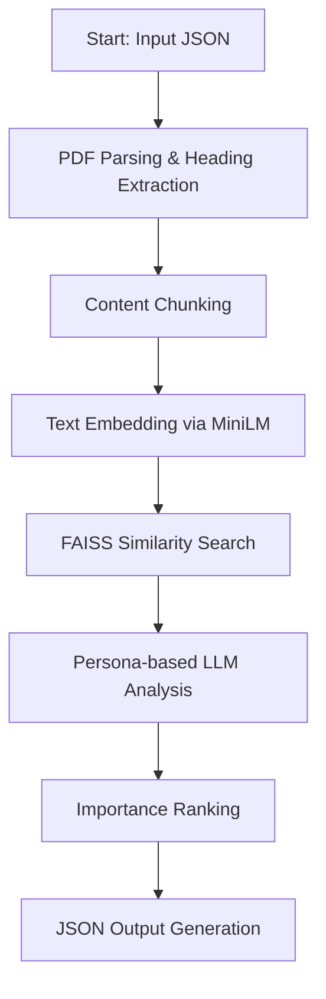

# Adobe Round 1b: Multi-Collection PDF Analysis

### Libraries Used

- **PyMuPDF (fitz)**: PDF processing
- **sentence-transformers**: Text embeddings
- **faiss-cpu**: Vector similarity search
- **transformers**: LLM integration
- **numpy**: Numerical operations
- **jsonschema**: JSON validation

## Core Components

### 1. Content Extraction
- **Module**: `extract/`
- **Key Classes**: 
  - `PDFHeadingExtractor`: Extracts document structure and headings
  - `ContentChunker`: Splits content into analyzable segments
- **Libraries**: PyMuPDF (fitz) for PDF processing

### 2. Text Embedding
- **Module**: `embed/`
- **Implementation**: MiniLM-based embeddings
- **Purpose**: Convert text chunks to vector representations
- **Libraries**: sentence-transformers

### 3. Information Retrieval
- **Module**: `retrieval/`
- **Features**:
  - FAISS index for similarity search
  - Prompt construction for context-aware analysis
- **Libraries**: faiss-cpu

### 4. LLM Integration
- **Module**: `llm/`
- **Purpose**: Persona-based content analysis and ranking
- **Features**: Context-aware response generation

## Key Features
- Persona-specific content analysis
- Multi-document correlation
- Importance-based section ranking
- Structured JSON output
- Collection-wide context awareness

## Input/Output Format

### Input
```json
{
  "challenge_info": {
    "challenge_id": "round_1b_XXX",
    "test_case_name": "specific_test_case"
  },
  "documents": [{"filename": "doc.pdf", "title": "Title"}],
  "persona": {"role": "User Persona"},
  "job_to_be_done": {"task": "Use case description"}
}
```
### Output
```json
{
  "metadata": {
    "input_documents": ["list"],
    "persona": "User Persona",
    "job_to_be_done": "Task description"
  },
  "extracted_sections": [
    {
      "document": "source.pdf",
      "section_title": "Title",
      "importance_rank": 1,
      "page_number": 1
    }
  ],
  "subsection_analysis": [
    {
      "document": "source.pdf",
      "refined_text": "Content",
      "page_number": 1
    }
  ]
}
```

### Processing Pipeline

