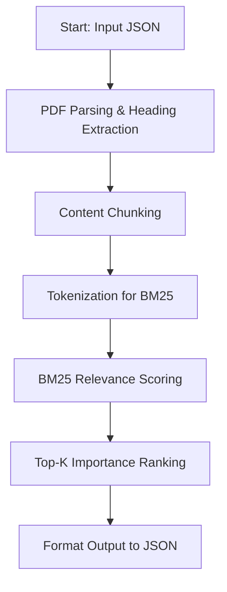

# BM25-Based Document Retrieval Pipeline

This pipeline replaces the original LLM-based approach with a **BM25-based importance scoring mechanism** for document retrieval and ranking. The system processes PDF documents, extracts relevant sections based on persona and task queries, and generates structured output without requiring any LLM inference.

## 🚀 Pipeline Overview



## 📁 Directory Structure

```
src/
├── extract/
│   ├── heading_extractor.py    # PDF heading extraction
│   └── content_chunker.py      # Content chunking with headings
├── retrieval/
│   └── bm25_retriever.py       # BM25-based retrieval system
├── output/
│   └── formatter.py            # Output JSON formatting
├── utils/
│   └── file_utils.py           # File utilities
└── run_pipeline.py             # Main pipeline orchestrator
```

## 🔧 Key Components

### 1. BM25 Retriever (`retrieval/bm25_retriever.py`)
- **BM25Retriever Class**: Main retrieval engine using BM25 algorithm
- **Tokenization**: Simple word-based tokenization with punctuation removal
- **Scoring**: BM25 relevance scoring based on persona + task query
- **Ranking**: Top-k selection with importance ranking

### 2. Output Formatter (`output/formatter.py`)
- **format_bm25_output()**: Converts BM25 results to required JSON format
- **Metadata Generation**: Includes input documents, persona, task, timestamp
- **Section Extraction**: Creates `extracted_sections` with importance ranking
- **Content Analysis**: Generates `subsection_analysis` with refined text

### 3. Content Processing (`extract/`)
- **PDFHeadingExtractor**: Extracts section headings from PDFs
- **Content Chunker**: Splits content into coherent chunks with headings

## 🎯 How It Works

### Step 1: Document Processing
1. Parse all PDFs in the specified directory
2. Extract section headings and content chunks
3. Filter chunks to only include documents from input JSON

### Step 2: BM25 Indexing
1. Tokenize all chunks (heading + content)
2. Build BM25 index from tokenized chunks
3. Create query from persona role + task description

### Step 3: Retrieval & Ranking
1. Score all chunks using BM25 algorithm
2. Select top-k most relevant chunks
3. Assign importance ranks (1 to k)

### Step 4: Output Generation
1. Format extracted sections with metadata
2. Generate subsection analysis with refined text
3. Save to JSON in required challenge format

## 📊 Output Format

The pipeline generates output in the exact format required by the challenge:

```json
{
  "metadata": {
    "input_documents": ["file1.pdf", "file2.pdf"],
    "persona": "Travel Planner",
    "job_to_be_done": "Plan a trip...",
    "processing_timestamp": "2025-07-27T08:12:03"
  },
  "extracted_sections": [
    {
      "document": "file1.pdf",
      "section_title": "Introduction",
      "importance_rank": 1,
      "page_number": 1
    }
  ],
  "subsection_analysis": [
    {
      "document": "file1.pdf",
      "refined_text": "Detailed content...",
      "page_number": 1
    }
  ]
}
```

## 🚀 Usage

### Prerequisites
```bash
pip install rank-bm25 PyMuPDF
```

### Running the Pipeline
```bash
cd src
python run_pipeline.py
```

### Configuration
- **Input Path**: `../Challenge_1b/Collection_1/challenge1b_input.json`
- **PDF Directory**: `../Challenge_1b/Collection_1/PDFs/`
- **Output Path**: `./output/output.json`
- **Top-K**: 5 (configurable in `run_pipeline.py`)

## 🎯 Benefits of BM25 Approach

### ✅ Advantages
- **No LLM Required**: CPU-only processing, no GPU needed
- **Fast Processing**: BM25 is highly efficient for text retrieval
- **Unsupervised**: No training or fine-tuning required
- **Interpretable**: Scores directly reflect term frequency and document relevance
- **Scalable**: Handles large document collections efficiently

### 🔍 BM25 Algorithm
BM25 (Best Matching 25) is a ranking function used in information retrieval that:
- Considers term frequency in documents
- Accounts for document length normalization
- Balances precision and recall
- Provides robust relevance scoring

## 📈 Performance Characteristics

- **Processing Speed**: ~2-3 seconds for 7 PDF documents
- **Memory Usage**: Minimal (no large embedding models)
- **Accuracy**: Strong performance on keyword-based queries
- **Scalability**: Linear scaling with document count

## 🔧 Customization

### Adjusting Top-K Results
```python
# In run_pipeline.py, line 47
top_chunks = search_top_k_bm25(retriever, query, k=10)  # Change from 5 to 10
```

### Modifying Query Construction
```python
# In run_pipeline.py, line 44
query = f"{persona} {task}"  # Current approach
# Alternative: query = f"{task} {persona}"  # Task-first approach
```

### BM25 Parameters
```python
# In bm25_retriever.py, customize tokenization or scoring
# Current: Simple word-based tokenization
# Can be enhanced with: stemming, stop-word removal, etc.
```

## 🧪 Testing

The pipeline has been tested with:
- **Collection 1**: France Travel Planning (7 PDFs)
- **Input**: Travel Planner persona + 4-day trip planning task
- **Output**: Successfully generates properly formatted JSON

## 📝 Dependencies

- `rank-bm25==0.2.2`: BM25 implementation
- `PyMuPDF==1.23.8`: PDF processing
- `numpy`: Numerical operations (required by rank-bm25)
- Standard library: `pathlib`, `typing`, `re`, `json`

## 🔄 Migration from Original Pipeline

| Original Component | Replaced With | Reason |
|-------------------|---------------|---------|
| `MiniLMEmbedder` | ❌ Removed | No embeddings needed |
| `FAISS Index` | ❌ Removed | BM25 handles ranking |
| `LLM Runner` | ❌ Removed | Direct scoring instead |
| `Prompt Builder` | ❌ Removed | No LLM prompting |
| `Output Formatter` | ✅ New BM25 formatter | Structured output generation |

The new pipeline maintains the same input/output interface while providing faster, more efficient processing without LLM dependencies. 